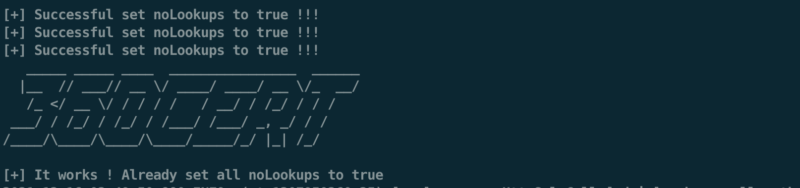

# 360CERT发布基于Lookup的Log4j2热修复方案

## 漏洞简述

目前，网上给出的log4j2修复方案基本都需要重启服务，360CERT提供一种不需要重启服务就能实现修复的方案Demo，不过需要明确知道漏洞点的位置，此方案偏向技术研究性质。


**目前该方案不一定对所有服务有效，测试了部分常用中间件，均可以修复，不建议完全依赖此方案进行修复，此方案是测试Demo，通过该方案热修复后如果重启服务，那么修复失效，需重新修复。**


**建议最佳方案依然是升级到官方的最新版本。**

## 使用介绍

1. 编译： `mvn clean install` ，生成jar包 `target/Log4shell-1.0-SNAPSHOT-jar-with-dependencies.jar`
1. 运行： `java -jar target/Log4shell-1.0-SNAPSHOT-jar-with-dependencies.jar` ，Ldap默认在1389端口，http服务默认在7777端口
1. 请求任一漏洞点，例如， `curl -vv '127.0.0.1:8080/errlog?msg=$%7Bjndi:ldap://127.0.0.1:1389/patch%7D'`

## 修复测试
这里测试了一些有漏洞的中间件。

### SpringBoot
手动写了一个存在漏洞的点。

``` java
@RequestMapping(value="/errlog",method= RequestMethod.GET)
    public void getError(@RequestParam("msg") String msg){
        logger.error("Error msg : " + msg);
}
```

然后去该point发起一个ldap请求：
 `127.0.0.1:8080/errlog?msg=$%7Bjndi:ldap://127.0.0.1:1389/patch%7D`

这里的ldap服务上的class就是修复nolookups的class，代码在PatchClass里。
请求之后，如果 `console` 出现


那么代表所有实例里的 `nolookups` 已经被设置为 `true` ，再次发起请求会被 `MessagePatternConverter` 阻断。


### Apache Solr
先测试恶意加载EvilClass


接着加载PatchClass


Apache Solr 成功修复



### Apache Struts2 show-case
apache struts2 show-case 成功修复


### Apache Ofbiz
apache ofbiz 成功修复


### Apache Druid
apache druid 成功修复


## 技术细节

- log4j版本要求：>=2.7。
- JDK版本要求：小于11.0.1、小于8u191、小于7u201、小于6u211，即jdk版本还能加载远程 ldap class。

整个思路是通过反射将 `logger` 实例 `config` 里的 `noLookups` 属性设置为 `true` 。

通过获取 `PatternParser` 的 `patternConverters` 属性里的 `MessagePatternConverter` 运行时实例，修改 `nolookups` 为 `true` 。

经过查找，发现 `PatternLayout` 的 `getEventSerializer` 方法能够获取到 `MessagePatternConverter` 的实例，由于2.11.0版本之前没有 `getEventSerializer` 方法，所以这里采用反射获取更加通用。

``` java
public Serializer getEventSerializer() {
        return eventSerializer;
}
```

`eventSerializer` 里，存放 `MessagePatternConverter` 实例。


接着寻找获取 `PatternLayout` 实例的方法， `ConsoleAppender#getLayout()` 可以获取。
 `ConsoleAppender` 需要通过 `AppenderControl#getAppender` 进行获取
 那如何获取 `AppenderControl` ，通过 `LoggerConfig` 的 `getAppenders` 方法获取，获取到一个 `map` ， `map` 里就存放 `AppenderControl` 。

``` java
public Map<String, Appender> getAppenders() {
        return appenders.asMap();
}
```

接着，获取 `loggerConfig` 实例，通过创建 `logger` 对象进行获取 `this.privateConfig.loggerConfig` 。


通过 `LogManager.getLogger()` 发现 `looger` 对象的实例是不唯一的。

但是，我们注意到，即使 `logger` 是不同的实例，但是 `config` 都是唯一实例，所以可以通过获取 `logger` 下的 `config` 来修改 `nolookups` 属性。


这里的 `appenders` 可能不止一个，所以需要遍历所有 `appenders` 下的 `formatters` ，而 `formatters` 可能存在递归嵌套的情况，所以也需要考虑通过递归所有 `formatters` ，去寻找 `MessagePatternConverter` 的实例。


所以，为了不重启服务，我们需要将反射的相关代码写到ldap要加载的class里，然后到存在漏洞点的地方让当前服务去加载远程class即可。